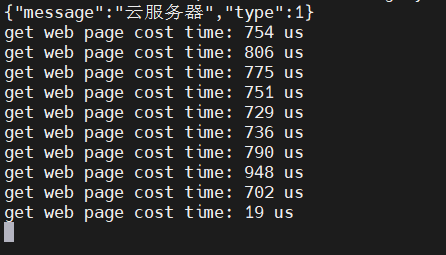
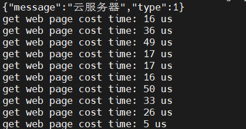
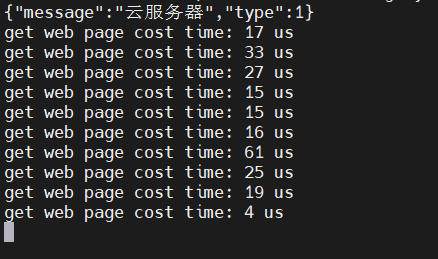

## 编译安装 benchmark

```shell
git clone https://github.com/google/benchmark.git
cd benchmark
cmake -E make_directory "build"
cmake -E chdir "build" cmake -DBENCHMARK_DOWNLOAD_DEPENDENCIES=on -DCMAKE_BUILD_TYPE=Release ../
cmake --build "build" --config Release
cmake --install build
```

## CMake关键写法

```C++
target_link_libraries(项目名称 PRIVATE benchmark pthread)
```

## benchmark基本使用

### 测试函数或类的成员函数

```
static void bench_src_buildMap(benchmark::State &state) {
  
  // 构造对象 m_en_dictionary

  for (auto _ : state) {
    m_en_dictionary->buildMap();	// 调用要测试的函数
  }
}

// 注册基准测试
BENCHMARK(bench_src_buildMap);
BENCHMARK_MAIN();
```

## 一次性读取所有文件到内存中，减少IO次数

### 案例一

```C++
std::string line;
while ( getline( file, line ) )  /* 从 file 中 多次按行读取，磁盘 IO 交互频繁 */
{
	auto words = m_split_tool->rmStopWords( line );
	for ( const auto &item : words )
	{
		m_map[item]++;
	}
}
```

这种按行从文件描述符中读取数据会多次与 I/O 交互，优化方式是把文件中的数据一次性读取到字符串中保存（内存中）。

你可能会说那这个时候在内存中按行读取情况下是不是要快？测试结果是并没有，反而更慢了。

那是因为将整个文件内容拷贝到内存中后，又通过 `std::istringstream` 创建了一个新的流，这会进一步增加内存消耗。

```C++
std::ifstream file( entry.path() );
file.seekg( 0, std::ios::end );
std::streampos file_size = file.tellg();
file.seekg( 0, std::ios::beg );
std::string content( file_size, '\0' );
file.read( content.data(), file_size );
std::istringstream	stream( content );
std::string		line;
while ( getline( stream, line ) )
{
	auto words = m_split_tool->rmStopWords( line );
	for ( const auto &item : words )
	{
		m_map[item]++;
	}
}
```

测试结果：build_target_buildMap 是优化后的代码，bench_src_buildMap 是优化前的代码。

```c++
----------------------------------------------------------------
Benchmark                      Time             CPU   Iterations
----------------------------------------------------------------
bench_target_buildMap 1968450933 ns   1968129654 ns            1
bench_src_buildMap    1935046996 ns   1934875069 ns            1
```

下面这份代码是把所有文件内容读取到内存中，并把整个字符串交给 rmStopWords 接口处理。

```c++
std::ifstream file( entry.path() );
file.seekg( 0, std::ios::end );
std::streampos file_size = file.tellg();
file.seekg( 0, std::ios::beg );
std::string content( file_size, '\0' );
file.read( content.data(), file_size );
auto words = m_split_tool->rmStopWords( content );
for ( const auto &item : words )
{
	m_map[item]++;
}
```

测试结果：build_target_buildMap 是优化后的代码，bench_src_buildMap 是优化前的代码。

```c++
----------------------------------------------------------------
Benchmark                      Time             CPU   Iterations
----------------------------------------------------------------
bench_target_buildMap 1780192903 ns   1779520701 ns            1
bench_src_buildMap    1903834057 ns   1903639273 ns            1
```

### 案例二

下面，接着看同样的例子，即一次性导入内存和多次和磁盘交互的性能差距：

访问磁盘：

```c++
std::string CandidatePage::getWebPageInfo(int page_id) {
  auto iter = m_offset.find(page_id);
  if (iter != m_offset.end()) {
    auto start = iter->second.first;
    auto end = iter->second.second;
    m_dict_ifs->seekg(start, std::ios::beg);
    std::string word(end, 0);
    m_dict_ifs->read(word.data(), end);
    m_dict_ifs->seekg(0, std::ios::beg);
    return word;
  }
  return "";
}
```

时间测试情况：



访问内存：

```c++
std::string CandidatePage::getWebPageInfo(int page_id) {
  auto item = m_page_info.find(page_id);
  std::string result;
  if (item != m_page_info.end()) {
    result = item->second;
  }
  return result;
}
```

时间测试情况：



访问到的页面信息越大，那么读取磁盘消耗的时间就越大，而内存中只涉及一次拷贝的消耗。

你可能想着这里能返回引用该多好，就可以避免这次拷贝。

```c++
std::string& CandidatePage::getWebPageInfo(int page_id) {
  auto item = m_page_info.find(page_id);
  if (item != m_page_info.end()) {
    return item->second;
  }
  static std::string empty_string;
  return empty_string;
}
```

时间测试情况：



并没有太大的提升，还是不要执着于这里了，离开吧。
